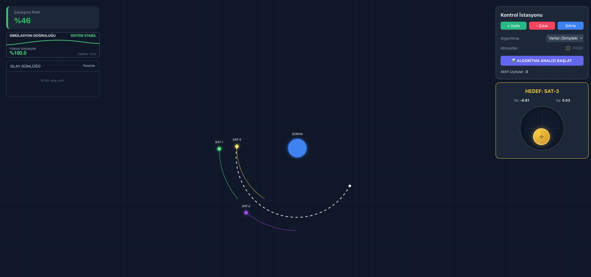
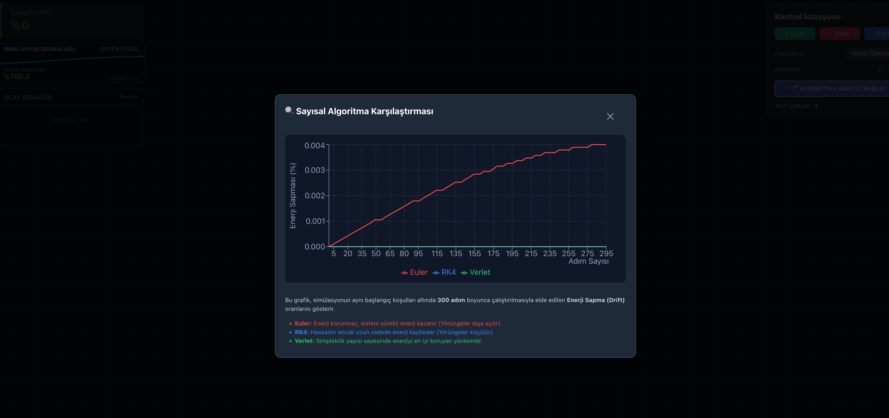
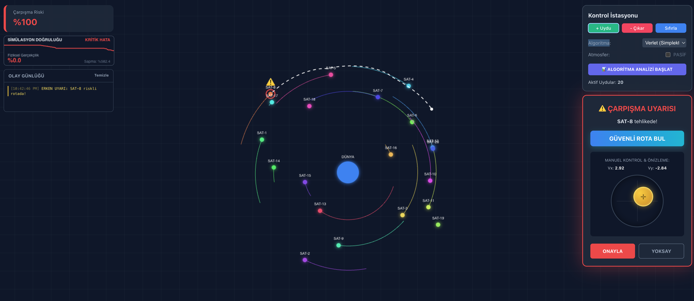

# N-Cisim Simülasyonu

Yörünge mekaniği, uydu dinamikleri ve sayısal integrasyon algoritmalarını görselleştirmek için gerçek zamanlı, etkileşimli 2D n-cisim simülasyonu.

## Özellikler

- **Gerçekçi Fizik:** Dünya ve birden fazla uydu arasındaki kütleçekimsel etkileşimleri simüle eder.
- **Çoklu Entegratörler:** Euler, Verlet (Simplektik) ve Runge-Kutta 4 (RK4) yöntemlerini karşılaştırın.
- **Atmosferik Sürüklenme:** Alçak yörüngeler için isteğe bağlı sürüklenme etkisi.
- **Çarpışma Algılama:** Uydular ve Dünya arasındaki çarpışmaları algılar ve kaydeder.
- **Manuel & Acil Durum Kontrolü:** Uydu hızlarını manuel olarak veya yapay zeka destekli kaçış manevralarıyla ayarlayın.
- **Enerji Analizi:** Her algoritma için enerji sapmasını görselleştirir.
- **Kepler Analizi:** Seçili uydular için yörünge parametrelerini gösterir.
- **Etkileşimli Arayüz:** Sürükle-bırak hız joystick'i, gerçek zamanlı loglar ve risk analizi.

## Başlarken

### Gereksinimler

- Node.js (v16+ önerilir)
- npm veya yarn

### Kurulum

```bash
git clone https://github.com/yourusername/n-body-simulation.git
cd n-body-simulation
npm install
# veya
yarn install
```

### Uygulamayı Çalıştırma

```bash
npm run dev
# veya
yarn start
```

Ardından tarayıcınızda [http://localhost:5173](http://localhost:5173) adresini açın.

## Kullanım

- **Uydu Ekle/Çıkar:** Kontrol panelini kullanarak uydu ekleyin veya çıkarın.
- **Algoritma Seçimi:** Entegrasyon için Verlet, RK4 veya Euler arasında seçim yapın.
- **Manuel Kontrol:** Bir uyduya tıklayın ve hızını joystick ile ayarlayın.
- **Acil Durum:** Çarpışma riski algılanırsa, AI veya manuel kontrollerle önleyin.
- **Analiz:** Zamanla enerji sapmasını görmek için algoritma karşılaştırmasını başlatın.

## Ekran Görüntüleri





## Lisans

MIT

## Yazar

Melih Şahin
